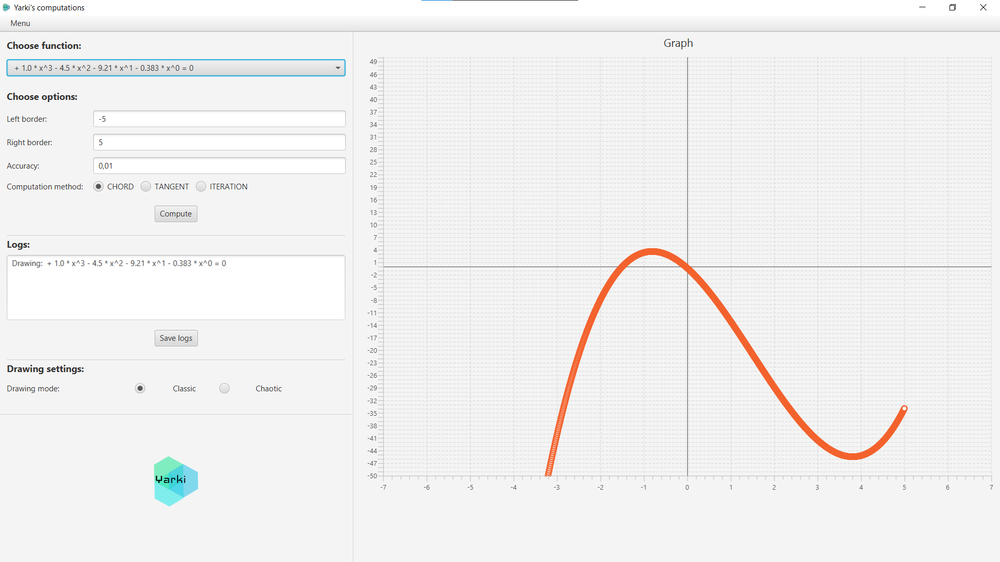
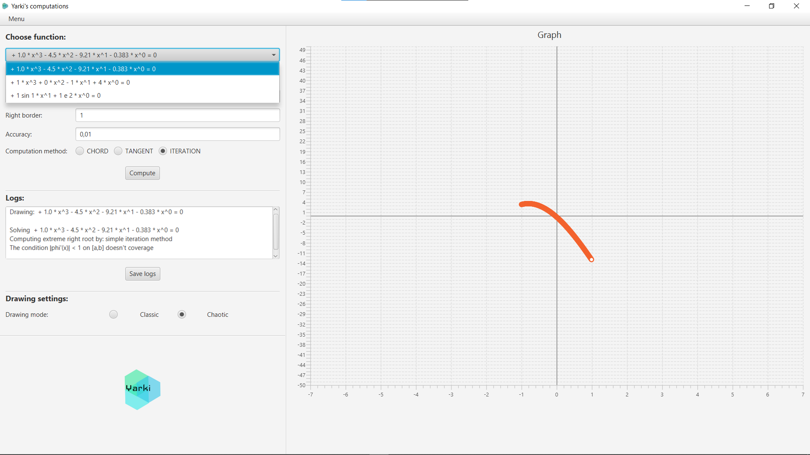

# Computational math lab 2

[![GitHub stars][stars-shield]][stars-url]
[![GitHub issues][issues-shield]][issues-url]
[![GitHub][license-shield]][license-url]


## About the project
Stack of technologies:
- TornadoFX
- Gson

## О проекте
В лабораторной можно решать уравнения вида f(x) = 0 методом хорд, Ньютона и простой итерации. 
Программой предустановлены 3 уравнения, с которыми можно поиграть, но архитектура выдерживает и добавления 
модуля для динамического импорта уравнений и их решения (пока что только полиноминальных). 
Также можно выгрузить конфигурацию или загрузить ее в json файл, а также сохранить историю вычислений в формате TXT.
Все это дело реализуется через GUI.

##  Как заставить работать
```[root] gradlew clean jar``` <br/>
```cd build/libs/```<br/>
```java -jar solver.jar```

## Как выглядит



[stars-shield]: https://img.shields.io/github/stars/burevestnik-png/comp-math-lab2?style=social
[stars-url]: https://github.com/burevestnik-png/comp-math-lab2/stargazers
[issues-shield]: https://img.shields.io/github/issues/burevestnik-png/comp-math-lab2
[issues-url]: https://github.com/burevestnik-png/comp-math-lab2/issues
[license-shield]: https://img.shields.io/github/license/burevestnik-png/comp-math-lab2
[license-url]: https://github.com/burevestnik-png/comp-math-lab2/blob/master/LICENSE
